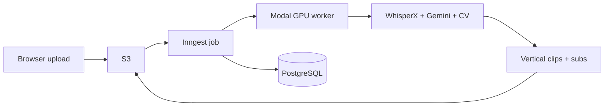

<div align="center">

# AI Podcast Clipper

**Long podcasts → short, vertical clips** — transcription, moment detection, active-speaker framing, and burned-in subtitles, orchestrated end-to-end.

[](https://nextjs.org/)
[](https://modal.com/)
[](https://www.prisma.io/)

</div>

---

## What it does

Upload a landscape podcast recording. The pipeline **transcribes** the audio (WhisperX), **finds Q&A and story arcs** worth clipping (Google Gemini), **reframes** around the active speaker for **9:16**, **renders subtitles**, and writes finished clips to **S3** while the web app tracks jobs, credits, and downloads.



---

## Features

| Capability | Detail |
|------------|--------|
| **Smart segments** | Gemini analyzes word-timed transcripts for ~30–60s clips (stories, questions → answers). |
| **Vertical reframing** | Active-speaker detection and crop to **1080×1920** for Shorts / Reels / TikTok. |
| **Accurate captions** | Word-level alignment; subtitles burned in with FFmpeg. |
| **Production-shaped app** | Google auth, dashboard, Stripe billing hooks, background jobs via **Inngest**. |

---

## Repository layout

```
ai-podcast-clipper/
├── ai-podcast-clipper-frontend/   # Next.js 15 · Prisma · NextAuth · Inngest · S3 · Stripe
└── ai-podcast-clipper-backend/    # Modal app: WhisperX, Gemini, OpenCV, FastAPI endpoint
```

---

## Tech stack

**Web app** — [Next.js](https://nextjs.org) (App Router), [Tailwind CSS v4](https://tailwindcss.com), [shadcn/ui](https://ui.shadcn.com), [Prisma](https://www.prisma.io) + PostgreSQL, [Auth.js](https://authjs.dev) (Google), [Inngest](https://www.inngest.com), [AWS S3](https://aws.amazon.com/s3/), [Stripe](https://stripe.com).

**ML / video** — [Modal](https://modal.com) (GPU class workers), [WhisperX](https://github.com/m-bain/whisperX), [Google Gen AI](https://ai.google.dev/) (Gemini), FFmpeg / OpenCV, active-speaker pipeline under `asd/`.

---

## Prerequisites

- **Node.js** 18+ and npm  
- **Python** 3.12+ (for local Modal scripts)  
- **PostgreSQL**  
- **AWS S3** bucket and IAM credentials  
- **Google** OAuth (app) + **Gemini API** key (Modal secret)  
- **Modal** account (`modal setup`)  
- **Inngest** keys for durable jobs (see `.env.example`)  
- **Stripe** (optional for full billing locally)

---

## Quick start — frontend

```bash
cd ai-podcast-clipper-frontend
cp .env.example .env
# Fill DATABASE_URL, S3, Auth, Modal URL + token, Inngest, Stripe as needed

npm install
npm run db:push
npm run dev
```

App: **http://localhost:3000**

In a **second terminal**, run the Inngest dev server so background steps execute:

```bash
npm run inngest-dev
```

Dashboard: **http://localhost:8288**

Required env vars are documented in [`ai-podcast-clipper-frontend/.env.example`](ai-podcast-clipper-frontend/.env.example). Deployment notes live in [`ai-podcast-clipper-frontend/DEPLOYMENT.md`](ai-podcast-clipper-frontend/DEPLOYMENT.md).

---

## Quick start — Modal backend

```bash
cd ai-podcast-clipper-backend
python -m venv .venv && source .venv/bin/activate   # Windows: .venv\Scripts\activate
pip install modal
modal setup
pip install -r requirements.txt
```

Configure a Modal **secret** (e.g. `ai-podcast-clipper-secret`) with at least `GEMINI_API_KEY`, `AUTH_TOKEN` (must match `PROCESS_VIDEO_ENDPOINT_AUTH` in the frontend), and any AWS keys your worker uses for S3.

Deploy the HTTP worker:

```bash
modal deploy main.py
```

Copy the deployed **`process_video`** URL into the frontend `PROCESS_VIDEO_ENDPOINT`. For a one-off smoke test:

```bash
modal run main.py
```

---

## NPM scripts (frontend)

| Script | Purpose |
|--------|---------|
| `npm run dev` | Next.js dev server (Turbopack) |
| `npm run inngest-dev` | Local Inngest dev UI |
| `npm run build` / `npm start` | Production build & serve |
| `npm run db:push` | Sync Prisma schema to the DB |
| `npm run db:studio` | Prisma Studio |
| `npm run lint` / `npm run typecheck` | Quality gates |

---

## Design notes

- **Credits + concurrency**: Inngest functions gate processing on user credits and limit concurrency per user.  
- **Split architecture**: The Next app never runs GPU work; it delegates to Modal and polls S3 for outputs.  
- **Auth on the pipeline**: The Modal FastAPI endpoint expects a **Bearer** token checked against your configured secret.

---

<div align="center">

Built for creators who want **algorithm-ready clips** without manual timeline surgery.

</div>
